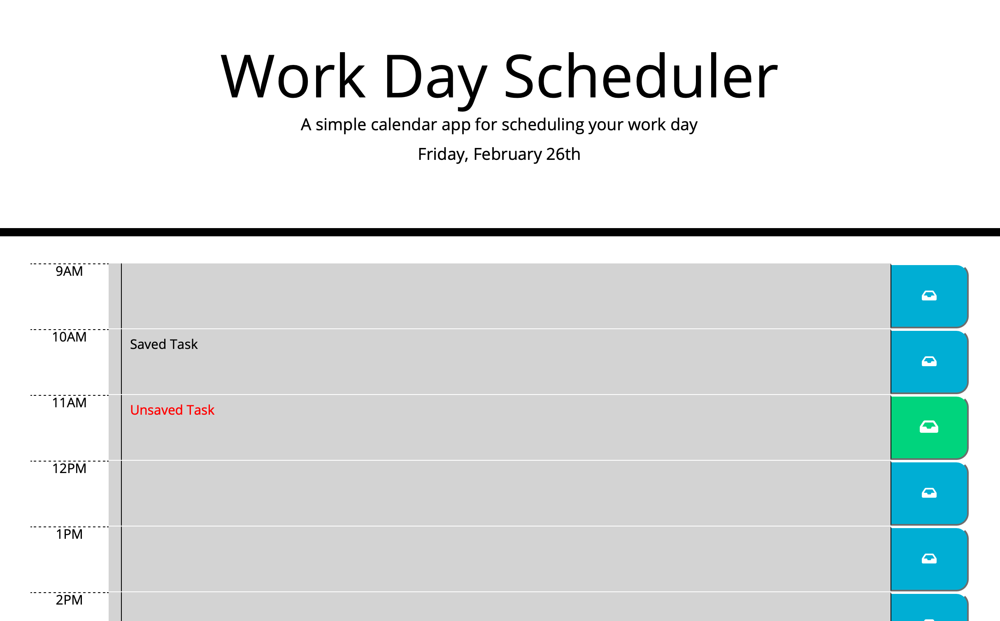

# Work Day Scheduler

## Description 

A simple daily scheduler that allows the user to save and view events in hour-long blocks. The current hour is highlighted in red and the upcoming hours are highlighted in green.

## Frameworks

* [jQuery](https://jquery.com)
* [Bootstrap](https://getbootstrap.com)
* [Moment.js](https://momentjs.com)

## Usage 

URL: [https://ghall89.github.io/work-day-scheduler/](https://ghall89.github.io/work-day-scheduler/)

* Click on an hour block and type the name of your event
* Click the save button to the right of the event to save your event
* Any unsaved events are displayed in red text
* Reload the page and watch in amazement as your events persist

